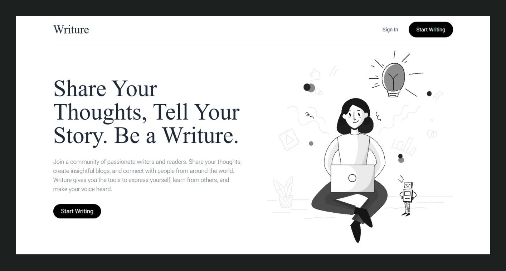

# Writure - A Simple, Multilingual Blog Platform

Writure is a clean, minimalist, and multilingual blog application built with Laravel and the TALL stack philosophy (Tailwind CSS, Alpine.js). It was developed to fulfill key learning objectives in backend and frontend development, resulting in a robust and feature-complete platform.



---

## ✅ Accomplished Project Goals

This project was built to master fundamental and advanced web development concepts. Here is a summary of the goals set for this project and how they were achieved:

* **Understand MVC, Routing, and CRUD Operations**: The application is built on the Laravel 11 framework, strictly following the Model-View-Controller (MVC) structure. It features basic and advanced routing and full Create, Read, Update, Delete (CRUD) functionality for posts, categories, tags, and users.
* **Build a Blog System with Authentication**: The core of the project is a functional blog where authenticated users can manage content. Authentication is handled by Laravel Breeze, providing secure registration, login, and password management.
* **Implement Advanced Backend Skills**: The project includes more advanced Laravel features such as middleware to protect admin routes, custom policies for authorization, and complex database relationships to handle multilingual content efficiently.
* **Responsive UI with Headless Components (Radix UI Principles)**: The UI is fully responsive, built with Tailwind CSS. A primary goal was to "Extend CRUD project with Radix UI components." While direct installation of Radix-related libraries was blocked by local environment issues, the core philosophy was successfully implemented. The project features custom-built, unstyled, and fully accessible components for modals, dropdowns, and tabs using Alpine.js, achieving the same headless UI objective.
* **Dynamic User Roles and Permissions**: The system implements a clear distinction between regular users and administrators. An `is_admin` flag on the users model, combined with an `IsAdmin` middleware, protects all backend routes and ensures only authorized users can perform administrative actions.

---

## ✨ Features

* **Multi-language Support**: Write and manage posts and categories in multiple languages.
* **Clean, Responsive UI**: A minimalist design built with Tailwind CSS that looks great on all devices.
* **SEO Optimized**: Built-in fields for SEO titles, descriptions, and keywords.
* **Intuitive Admin Panel**: A secure backend for managing users, posts, categories, and more.
* **User and Admin Roles**: Clear separation between standard user accounts and admin accounts.
* **Accessible Components**: Frontend components are powered by headless UI principles, ensuring they are robust and accessible.

---

## 📚 Documentation

For more detailed information, usage examples, and additional screenshots, please visit the **[Project Documentation](https://drive.google.com/drive/folders/18DaMqP_BC1EaxtNctHs98ANGK8UvNoGa?usp=sharing)**. 

---

## 🛠️ Tech Stack

* **Backend**: Laravel 11
* **Frontend**: Blade, Tailwind CSS, Alpine.js
* **Database**: MySQL / MariaDB
* **Development Environment**: Laravel Sail (Docker)

---

## 🚀 Installation and Setup

Follow these steps to get a local copy of Writure up and running.

1.  **Clone the Repository**
    ```bash
    git clone [https://github.com/your-username/writure.git](https://github.com/your-username/writure.git)
    cd writure
    ```

2.  **Install Dependencies**
    ```bash
    composer install
    npm install
    ```

3.  **Set Up Environment**
    ```bash
    cp .env.example .env
    php artisan key:generate
    ```

4.  **Configure `.env` File**
    * Open the `.env` file and set up your database connection details (`DB_HOST`, `DB_DATABASE`, `DB_USERNAME`, `DB_PASSWORD`).

5.  **Run Database Migrations and Seeders**
    * This will create all necessary tables and populate the site with dummy content, including an admin user.
    ```bash
    php artisan migrate --seed
    ```
    * An admin account will be created with the email `admin@writure.com` and the password `password`.

6.  **Compile Frontend Assets**
    ```bash
    npm run dev
    ```

7.  **Start the Server**
    * If using Laravel Sail:
        ```bash
        ./vendor/bin/sail up
        ```
    * If using a local server:
        ```bash
        php artisan serve
        ```
    You should now be able to access the application at `http://localhost:8000`.

---

## ⚙️ Usage

### Admin Panel

* **Access**: Navigate to `http://localhost:8000/login`.
* **Credentials**:
    * **Email**: `admin@writure.com`
    * **Password**: `password`
* **Features**:
    * **Dashboard**: A simple overview of your content.
    * **Users Management**: Create, edit, and delete users and assign admin roles.
    * **Content Management**: Full CRUD functionality for Posts, Categories, and Tags.

---

## 📜 License

This project is open-source and licensed under the MIT License.

Copyright (c) 2025 Jedidiah Villegas

Permission is hereby granted, free of charge, to any person obtaining a copy
of this software and associated documentation files (the "Software"), to deal
in the Software without restriction, including without limitation the rights
to use, copy, modify, merge, publish, distribute, sublicense, and/or sell
copies of the Software, and to permit persons to whom the Software is
furnished to do so, subject to the following conditions:

The above copyright notice and this permission notice shall be included in all
copies or substantial portions of the Software.

THE SOFTWARE IS PROVIDED "AS IS", WITHOUT WARRANTY OF ANY KIND, EXPRESS OR
IMPLIED, INCLUDING BUT NOT LIMITED TO THE WARRANTIES OF MERCHANTABILITY,
FITNESS FOR A PARTICULAR PURPOSE AND NONINFRINGEMENT. IN NO EVENT SHALL THE
AUTHORS OR COPYRIGHT HOLDERS BE LIABLE FOR ANY CLAIM, DAMAGES OR OTHER
LIABILITY, WHETHER IN AN ACTION OF CONTRACT, TORT OR OTHERWISE, ARISING FROM,
OUT OF OR IN CONNECTION WITH THE SOFTWARE OR THE USE OR OTHER DEALINGS IN THE
SOFTWARE.
